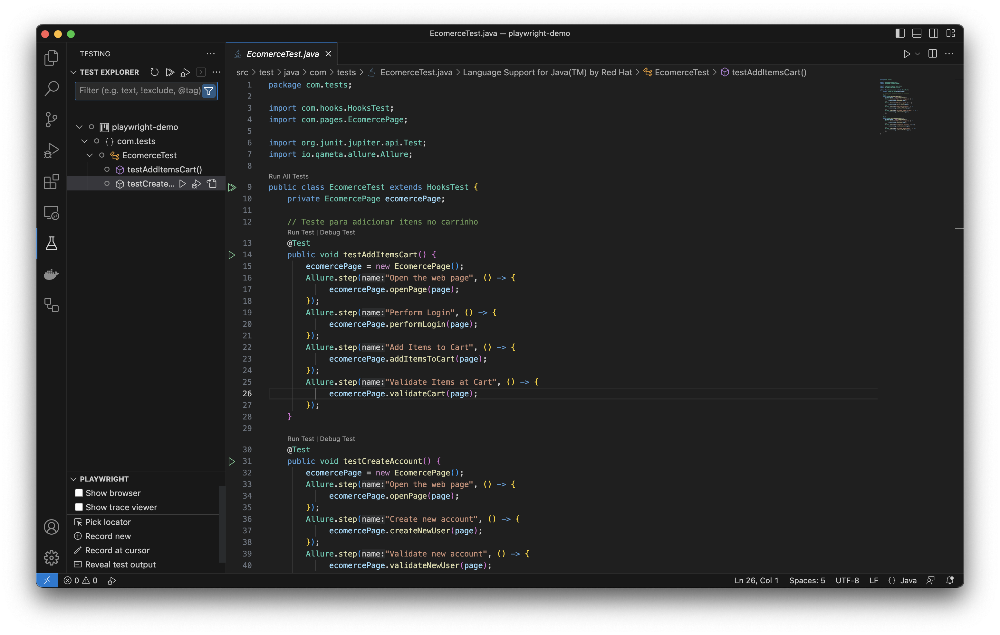

# playwright-java-demo

O Tamplete utilizando Java, jUnit, Playwight, Allure e Faker para realizar testes web de forma simoples.

## Recursos e Tecnologias Utilizadas

- Java: Linguagem de programação utilizada para desenvolver a automação de testes.
- Playwright: Biblioteca a fim de centralizar interação com elementos web e browsers.
- Maven: Ferramenta de automação de construção e gerenciamento de projetos Java.
- Allure: Ferramenta para geração de relatórios interativos de testes.
- jUnit: Framework de testes utilizado para executar os testes de forma estruturada.
- Faker: Biblioteca Java para geração de dados de teste aleatórios.

## Pré-requisitos

- Java JDK 15
- Maven
- VSCODE
- Java extension pack (vscode)

## Execução

Utilizando os playrs do prórpio VSCODE

